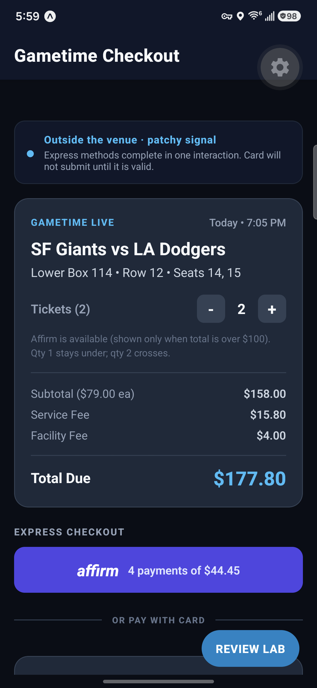
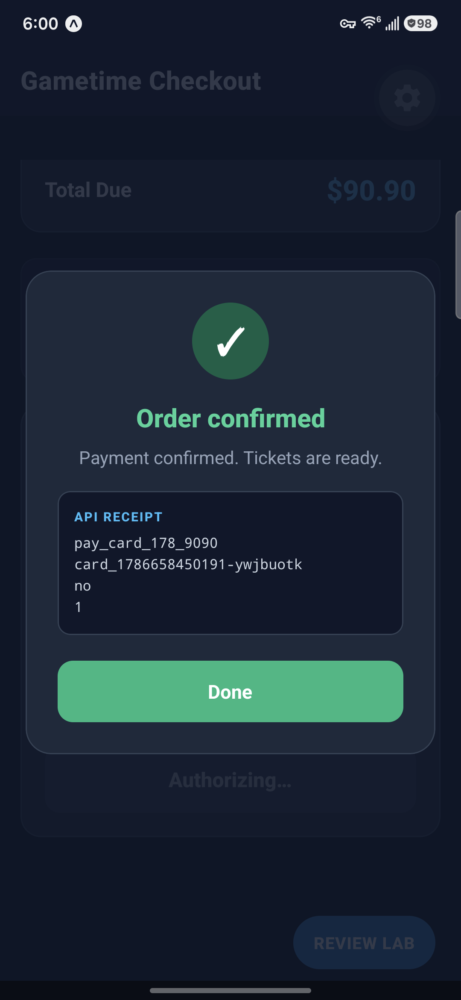
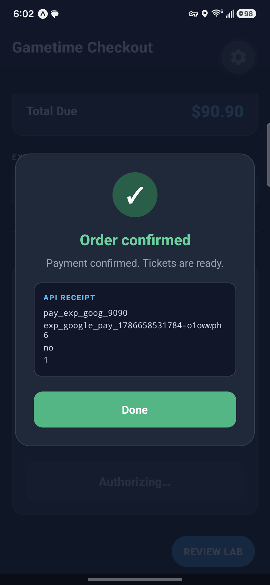

# Gametime Staff Mobile — Checkout & Payments

React Native (Expo) checkout for the Staff Mobile Engineer take-home.

A fan has already picked seats. This screen decides **which payment methods they are allowed to see**, makes **express pay actually express**, keeps **card entry honest**, and talks to a **mock payment API** whose contract is designed so a kill/relaunch cannot double-charge.

## Physical-device proof

<p align="center">
  
  
  
</p>

Verified on **2026-08-13 (Thursday, America/New_York)** with a physical Samsung Galaxy S25 (`SM-S931U1`, Android 16). The serialized Maestro suite passed all five flows in 4m23s: Affirm threshold, card success, issuer decline/retry, Google Pay cancel/success, and force-stop/relaunch recovery with the same idempotency key and one ledger row. The post-review acceptance gate also passed **9/9 Jest suites (83/83 tests)**, TypeScript, ESLint, Expo dependency pins, and `git diff --check`.

Deadline context: assignment email received **2026-08-12 (Wednesday)**; submit by **2026-08-17**.

## What I built

- Checkout screen: order summary, quantity (fees recompute), eligibility-gated express methods, card form, Review Lab.
- Pure eligibility engine (`src/services/eligibilityEngine.ts`).
- Card validation: formatting, brand, Luhn, future expiry, CVC length (`src/services/cardValidator.ts`).
- Wallet / Affirm **stubs** that mimic a native sheet and a redirect — tap completes in that flow. No second Submit.
- Mock API with a JSON request/response boundary, idempotency, a durable settlement record written before the wait, and GET-by-key reconciliation (`src/services/mockPaymentApi.ts`).
- AppState + persisted session + persisted ledger so background and kill/relaunch resume the **same** attempt.

Visual polish was deliberately second to eligibility, lifecycle, and form UX.

## How to run

Requires Node 20+.

```bash
npm ci
npm run test:acceptance
npx expo start --localhost
```

Then:

- iOS Simulator: `i`
- Android emulator: `a`
- Expo Go on a device: scan the QR (same LAN)

No paid Apple Developer account or real Apple Pay / Google Pay / Affirm credentials are required.

On first launch in the iOS Simulator you should **not** see Apple Pay. That is the honest default: simulators do not have a provisioned Wallet card. Open **REVIEW LAB** (bottom right) → platform `iOS` → cycle **Apple Pay provisioned** to `true`.

## Eligibility

| Method | Shown when |
|---|---|
| Apple Pay | Effective platform is iOS **and** a card is provisioned in Wallet |
| Google Pay | Effective platform is Android **and** Google Pay is set up |
| Affirm | Cart total is **strictly over $100.00** (`totalCents > 10000`) |
| Card | Always |

Detection default (`src/services/deviceCapabilities.ts`):

- Platform from `Platform.OS`.
- Wallet capability fails closed on every device until the native adapter is implemented. A production build would call `PKPaymentAuthorizationController.canMakePaymentsUsingNetworks` / `PaymentsClient.isReadyToPay`. Review Lab provides explicit test overrides; it never claims that the physical device is provisioned.

Review Lab can force platform and wallet independently so one device can exercise every branch.

Affirm reacts to quantity: default qty 1 is about **$90.90** (hidden); qty 2 is about **$177.80** (shown). Fees are integer cents.

## Mock API contract

`POST /v1/payments` shape (in-process, JSON cloned both ways):

```json
{
  "idempotencyKey": "card_<uuid>",
  "orderId": "ord_sf_la_lower_114",
  "paymentMethod": "credit_card",
  "amountCents": 9090,
  "currency": "usd",
  "paymentMethodToken": "tok_visa_4242"
}
```

Responses: `processing` | `captured` | `declined` | `cancelled` | `conflict`.

`GET /v1/payments/by-idempotency/:key` is `queryPaymentStatus`.

Why this shape:

- **Integer cents** — ticket + fee math never uses floats.
- **Token, never PAN** — `tokenizeCard` maps `4242…4242` → `tok_visa_4242` and `4000…0002` → `tok_visa_declined`.
- **Idempotency is the anti-double-charge primitive.** Same key + same fingerprint replays the original row. Same key + different amount/method/token is HTTP 409.
- **`processing`, the request fingerprint, and the settlement deadline are written before the simulated network wait.** If the app is killed mid-request, a new backend instance can settle and reconcile that row instead of inventing a new key.
- The transport is local, but the process-death contract is explicit: AsyncStorage survives the app process, while `MockPaymentBackend` can be reconstructed from the durable ledger. Swapping it for `fetch` preserves the client contract.

Failure paths the UI handles:

- Issuer decline (`4000 0000 0000 0002` or Review Lab → Issuer decline)
- Wallet / Affirm cancel (sheet Cancel — **no charge**)
- Lost 504 response after the mock accepted the charge (Review Lab → 504; UI GETs the same key)

## State flow

```
idle
  ├─ express tap → awaiting_wallet | awaiting_redirect  (sheet/redirect stub)
  │                   ├─ Pay/Continue → processing → captured | declined
  │                   └─ Cancel → cancelled (no API charge)
  └─ valid card Pay → processing → captured | declined
                         └─ 504 → reconciling → GET same key
```

Background (`AppState` → inactive/background) does **not** reset. The attempt (idempotency key, amount, method, token) is already on disk.

Kill + relaunch: hydrate the ledger, load the session, GET the key.

- captured → success (do not charge again)
- declined → show decline, new attempt needs a **new** key
- processing → poll the same key until the mock settlement deadline; never POST again
- missing → the POST never landed; a new attempt is safe

A local in-flight request is not overwritten by AppState recovery (that race is how you double-charge).

## Card UX

- Format and brand on keystroke.
- Luhn / expiry / CVC errors on blur once the field is long enough — so iOS/Google autofill can land a full PAN before we shout.
- `keyboardType="number-pad"`, `textContentType` / `autoComplete` for number, expiry, CVC.
- Pay stays disabled until the card is complete.

## Tradeoffs

- Durable local mock API instead of a separate Express process; Expo Go still exercises the request/response, idempotency, loss, and reconciliation contracts.
- Wallet / Affirm are stubs with the real interaction shape, not sandbox SDKs (per the brief).
- Context + hooks instead of XState — the state machine is small enough to read in one file.
- Ledger persistence is AsyncStorage, not SQLite. Fine for one in-flight checkout.

## What I would do with more time

- Hosted mock (`msw` or a tiny Fastify) plus a recorded OpenAPI file.
- Replace the wallet stubs with the native Apple Pay / Google Pay readiness adapters and sandbox sheets.
- 3-D Secure / step-up as a second redirect state.
- SecureStore for the session, and a server-side unique constraint demo.
- Accessibility pass (Dynamic Type, VoiceOver on the wallet buttons).

## AI usage

See [AI_USAGE.md](./AI_USAGE.md). Gametime asked for where/why AI was used and how outputs were challenged.

## Tests (TDD + e2e instrumentation)

```bash
npm test          # Jest: domain + CheckoutController e2e + testID contract
npm run test:e2e  # controller integration + instrumentation contract
npm run test:maestro   # five real-device flows; Metro uses localhost:8082
npm run test:acceptance # 83 Jest tests + TypeScript + lint + Expo version pins
```

TDD: `cart.test.ts` and `checkoutController.e2e.test.ts` were written first (they failed on missing modules), then `CheckoutController` / `cart` / `MemoryKv` were implemented until green.

The controller suite is a fail-closed integration test of payment state (it does not render React Native):

- hide Apple Pay without Wallet; card still charges
- express is one interaction (sheet confirm charges; cancel writes no ledger row)
- Affirm appears only after qty crosses $100
- qty locked in flight
- decline token then new key succeeds
- kill mid-`processing` + rehydrate GET-replays one ledger row
- 504 reconciles the accepted charge on the same idempotency key
- incomplete card never hits the API

Physical-device instrumentation lives in `maestro/` and uses stable selectors from `src/testing/testIds.ts`. The five-flow suite covers Affirm threshold, card success, decline/retry, Google Pay cancel/success, and force-stop/relaunch with the same key and one ledger row. See `maestro/README.md` for the reproducible evidence command.
